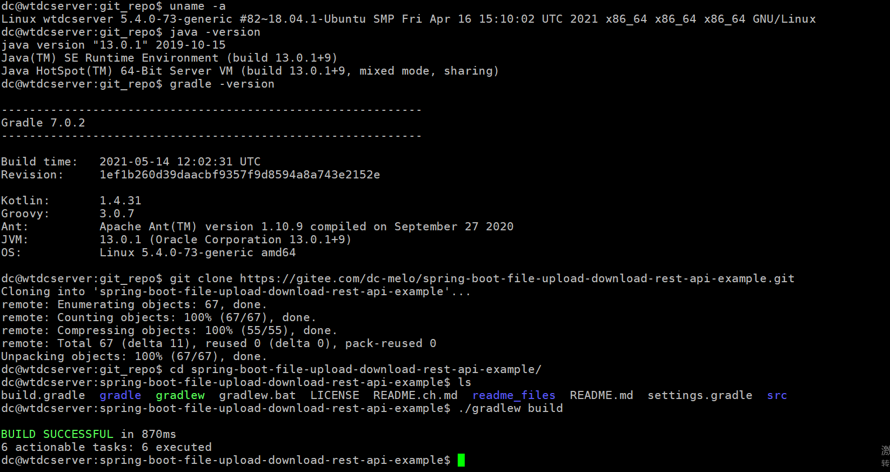
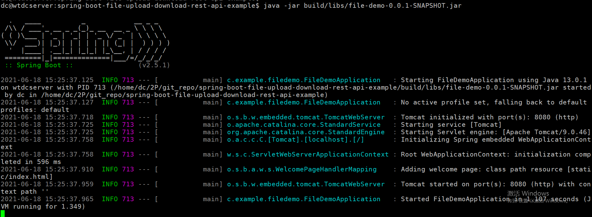
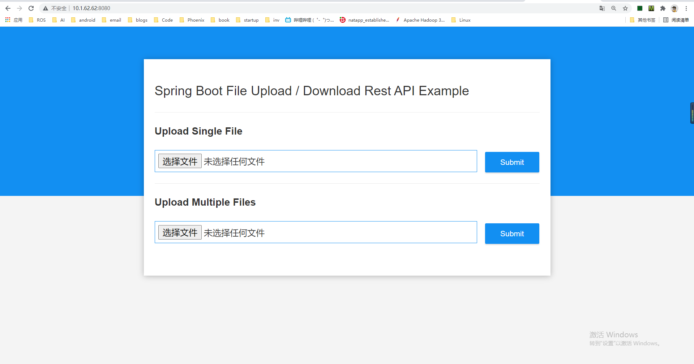

# DC Standard Readme

Uploading an Downloading files with Spring Boot

## Table of Contents

- [Background](#background)
- [Install](#install)
- [Usage](#usage)
	- [Generator](#generator)
- [Badge](#badge)
- [Example Readmes](#example-readmes)
- [Related Efforts](#related-efforts)
- [Maintainers](#maintainers)
- [Contributing](#contributing)
- [License](#license)

## Background

Uploading an Downloading files with Spring Boot

## Install

1. Enviroment
```sh
$ uname -a
Linux wtdcserver 5.4.0-73-generic #82~18.04.1-Ubuntu SMP Fri Apr 16 15:10:02 UTC 2021 x86_64 x86_64 x86_64 GNU/Linux
$ java -version
java version "13.0.1" 2019-10-15
Java(TM) SE Runtime Environment (build 13.0.1+9)
Java HotSpot(TM) 64-Bit Server VM (build 13.0.1+9, mixed mode, sharing)
$ gradle -version
------------------------------------------------------------
Gradle 7.0.2
------------------------------------------------------------
```
1. Clone the repository
```
git clone https://gitee.com/dc-melo/spring-boot-file-upload-download-rest-api-example.git

```
2. Specify the file uploads directory
```
cd spring-boot-file-upload-download-rest-api-example
```
Open src/main/resources/application.properties file and change the property file.upload-dir to the path where you want the uploaded files to be stored.
file.upload-dir=uploads

3. build the application 
```
./gradlew build
```


## Usage

1. run the jar application

```
java -jar target/file-demo-0.0.1-SNAPSHOT.jar
```


2. open the web 

That's it! The application can be accessed at http://localhost:8080.


### Generator


## Badge


## Example Readmes


## Related Efforts

- [Art of Readme](https://github.com/noffle/art-of-readme) - 💌 Learn the art of writing quality READMEs.
- [open-source-template](https://github.com/davidbgk/open-source-template/) - A README template to encourage open-source contributions.

## Maintainers

[@DC-Melo](https://github.com/DC-Melo).

## Contributing

Feel free to dive in! [Open an issue](https://github.com/RichardLitt/standard-readme/issues/new) or submit PRs.

Standard Readme follows the [Contributor Covenant](http://contributor-covenant.org/version/1/3/0/) Code of Conduct.

### Contributors

This project exists thanks to all the people who contribute. 
<a href="https://github.com/RichardLitt/standard-readme/graphs/contributors"></a>


## License

[MIT](LICENSE) © DC Melo
