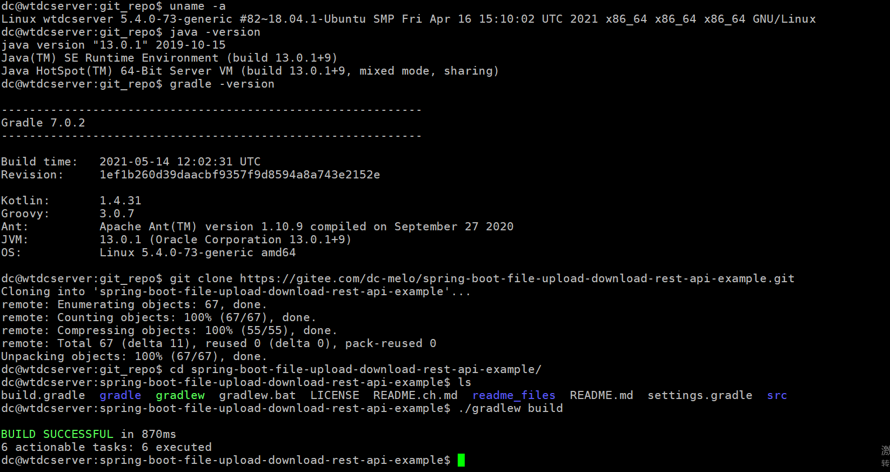
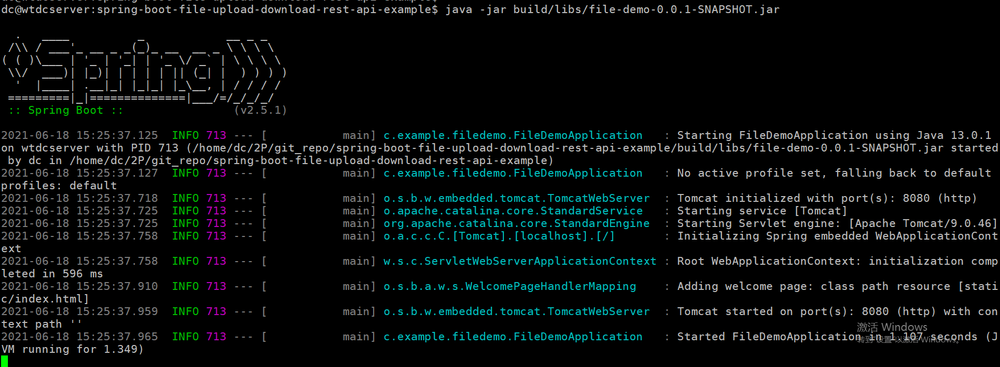

# spring-boot-file-upload-download-rest-api-example

[](https://github.com/RichardLitt/standard-readme)

文件上传下载应用

基于Gradle, Sprint-boot,开发的文件上传下载工具

## 内容列表

- [背景](#背景)
- [安装](#安装)
- [使用说明](#使用说明)
	- [生成器](#生成器)
- [徽章](#徽章)
- [示例](#示例)
- [相关仓库](#相关仓库)
- [维护者](#维护者)
- [如何贡献](#如何贡献)
- [使用许可](#使用许可)

## 背景

使用gradle,spring-boot 上传和现在文件

## 安装

编译运行环境
```sh
$ uname -a
Linux wtdcserver 5.4.0-73-generic #82~18.04.1-Ubuntu SMP Fri Apr 16 15:10:02 UTC 2021 x86_64 x86_64 x86_64 GNU/Linux

$ java -version
java version "13.0.1" 2019-10-15
Java(TM) SE Runtime Environment (build 13.0.1+9)
Java HotSpot(TM) 64-Bit Server VM (build 13.0.1+9, mixed mode, sharing)

$ gradle -version
------------------------------------------------------------
Gradle 7.0.2
------------------------------------------------------------
```

1. 克隆仓库
```
git clone https://gitee.com/dc-melo/spring-boot-file-upload-download-rest-api-example.git

```
2. 修改上传文件地址
```
cd spring-boot-file-upload-download-rest-api-example
```
Open src/main/resources/application.properties file and change the property file.upload-dir to the path where you want the uploaded files to be stored.
file.upload-dir=uploads

3. 编译生成jar包
```
./gradlew build
```


## 使用说明

1. 运行jar包

```
java -jar build/libs/file-demo-0.0.1-SNAPSHOT.jar 
```


2. 打开对应网站

在浏览器中打开：http://localhost:8080.


这只是一个文档包，你可以打印出 [spec.md](spec.md) 到输出窗口。

```sh
$ standard-readme-spec
# Prints out the standard-readme spec
```

### 生成器


## 徽章

## 示例

## 相关仓库

- [Art of Readme](https://github.com/noffle/art-of-readme) — 写高质量 README 的艺术。
- [open-source-template](https://github.com/davidbgk/open-source-template/) — 一个鼓励参与开源的 README 模板。

## 维护者

[@DC-Melo](https://github.com/DC-Melo)。

## 如何贡献

非常欢迎你的加入！[提一个 Issue](https://github.com/DC-Melo/standard-readme/issues/new) 或者提交一个 Pull Request。


标准 Readme 遵循 [Contributor Covenant](http://contributor-covenant.org/version/1/3/0/) 行为规范。

### 贡献者

感谢以下参与项目的人：
<a href="graphs/contributors"></a>


## 使用许可

[MIT](LICENSE) © DC Melo
